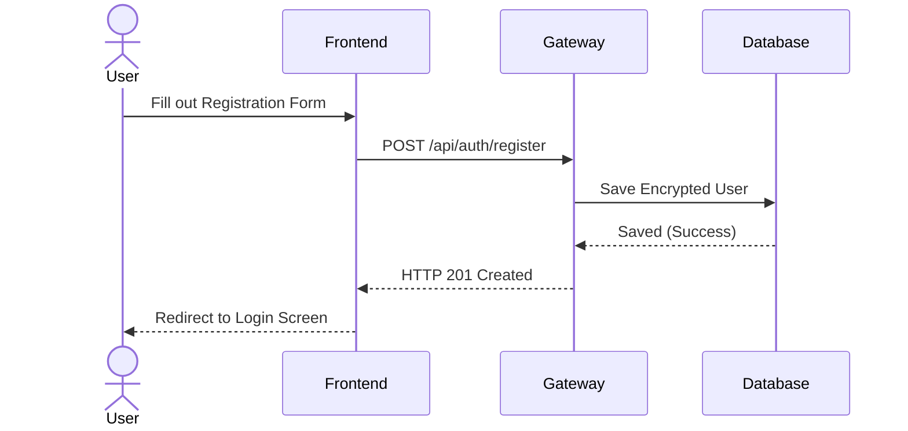
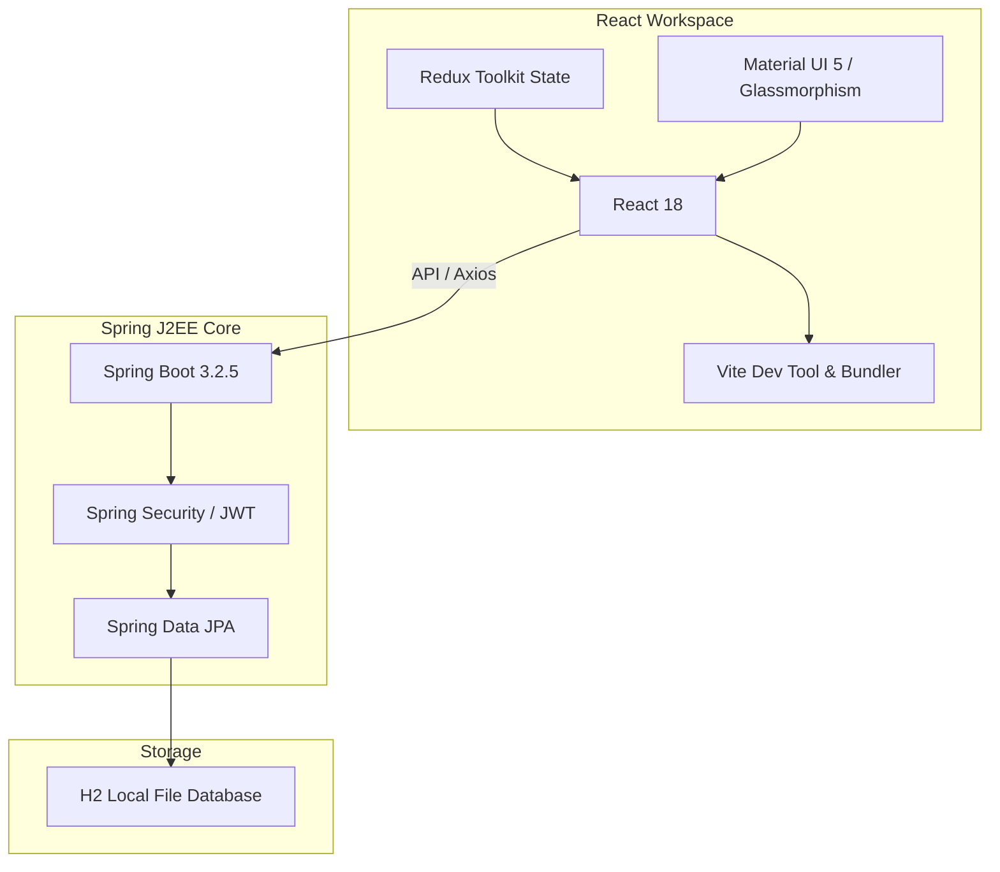
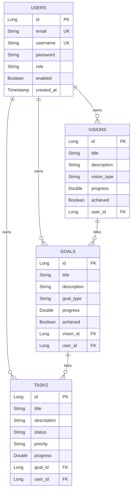
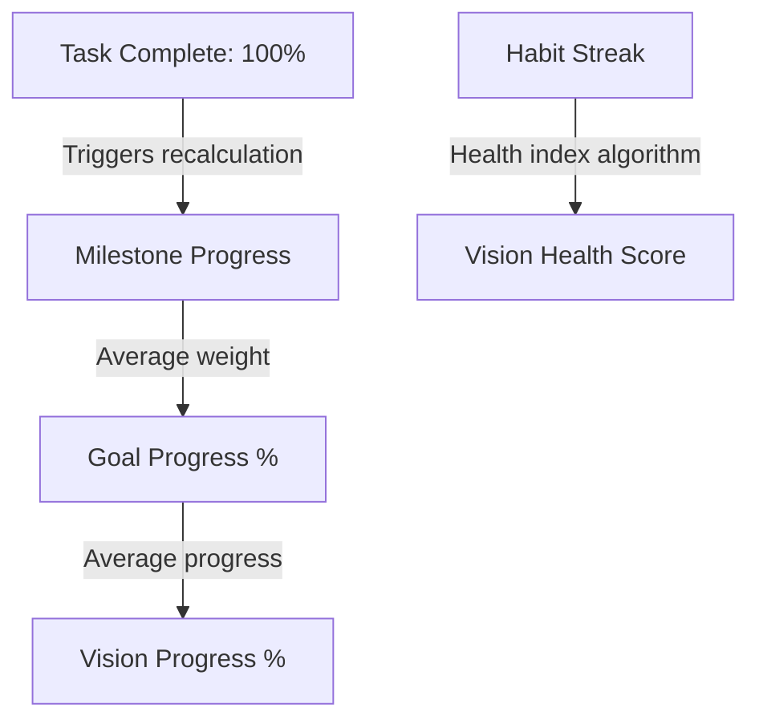

# Vision Board V1.0 Platform Handover Documentation

This documentation serves as a comprehensive developer handbook, product analysis, and system architecture blueprint for the **Vision Board** application. It contains all information necessary for new development teams to build, test, deploy, and extend the system.

---

## TABLE OF CONTENTS
1. [EXECUTIVE SUMMARY](#section-1---executive-summary)
2. [PRODUCT OVERVIEW](#section-2---product-overview)
3. [COMPLETE FEATURE INVENTORY](#section-3---complete-feature-inventory)
4. [DETAILED FEATURE DOCUMENTATION](#section-4---detailed-feature-documentation)
5. [FUNCTIONALITY MATRIX](#section-5---functionality-matrix)
6. [USER JOURNEYS](#section-6---user-journeys)
7. [BUSINESS RULES DOCUMENTATION](#section-7---business-rules-documentation)
8. [TECHNOLOGY STACK](#section-8---technology-stack)
9. [PROJECT STRUCTURE](#section-9---project-structure)
10. [SYSTEM ARCHITECTURE](#section-10---system-architecture)
11. [DATABASE DOCUMENTATION](#section-11---database-documentation)
12. [API DOCUMENTATION](#section-12---api-documentation)
13. [FRONTEND DOCUMENTATION](#section-13---frontend-documentation)
14. [BACKEND DOCUMENTATION](#section-14---backend-documentation)
15. [SECURITY DOCUMENTATION](#section-15---security-documentation)
16. [CONFIGURATION DOCUMENTATION](#section-16---configuration-documentation)
17. [DEPLOYMENT DOCUMENTATION](#section-17---deployment-documentation)
18. [TESTING DOCUMENTATION](#section-18---testing-documentation)
19. [CURRENT LIMITATIONS](#section-19---current-limitations)
20. [TECHNICAL DEBT ANALYSIS](#section-20---technical-debt-analysis)
21. [FUTURE ROADMAP](#section-21---future-roadmap)
22. [DATABASE MIGRATION STRATEGY](#section-22---migration-strategy)
23. [DEVELOPER HANDBOOK](#section-23---developer-handbook)

---

## SECTION 1 - EXECUTIVE SUMMARY

### Application Name
* **Vision Board V1.0** (also referred to as the Personal Task & Core Vision Tracker).

### Product Purpose
* To provide individuals with an integrated, premium self-development workspace that bridges the gap between long-term aspirations (Visions), mid-term milestones (Goals), daily tasks (Tasks), habits (Habits), thoughts (Notes), and reflections (Journal).

### Business Goal
* Create a high-engagement, single-tenant or multi-tenant dashboard workspace. It aims to increase user goal achievement rates by continuously aligning daily tasks with long-term aspirations, reducing context-switching across separate planning utilities.

### Target Audience
* Self-development enthusiasts, students, professionals, and remote teams seeking a unified task planner and visual personal growth tracker.

### Core Value Proposition
* **Alignment**: Bridges the daily grid with long-term career, relationship, or fitness visions.
* **Modern Interface**: Designed using rich glassmorphic aesthetics, deep dark mode support, and smooth UI transition cards.
* **Control**: Administrative capabilities to toggle features globally or per-user.

### Current Version & Product Maturity
* **Version**: V1.0 (Production-ready local build, ready for staging container deployments).
* **Maturity**: Stabilized MVP/Beta transitioning to active product refinement. Core domain APIs and frontend modules are complete.

---

## SECTION 2 - PRODUCT OVERVIEW

### Solved Problem
Individuals fail to achieve long-term visions because daily task managers are disconnected from core life objectives. Vision Board solves this by forcing users to link tasks to goals, and goals to life visions, forming an unbroken alignment chain.

### Main Use Cases
1. **Vision Setting**: Mapping long-term career, health, and relationship ambitions.
2. **Goal Breakdown**: Decomposing general visions into actionable goals with deadlines.
3. **Daily Task Routing**: Managing daily tasks categorized by status, priority, and optionally linked to goals.
4. **Routine Tracking**: Building consistency using daily/weekly habit trackers with streak metrics.
5. **Creative Catchment**: Fast note-taking and daily log journaling to track mood patterns.
6. **Feature Toggle Management**: Administrator control over feature availability.

### Product Boundaries
* The system is a closed ecosystem. It relies on standard JSON APIs and local secure cookies for authentication. External OAuth2 providers, sync integrations (Google Calendar, Apple Health), and AI advice engines are defined boundaries that the V1.0 architecture is designed to support but does not natively contain in the initial version.

---

## SECTION 3 - COMPLETE FEATURE INVENTORY

### 1. Authentication & Session
- **Registration**: Custom user creation with encrypted credentials.
- **Credential Sign-In**: Authenticates users and returns access JWT and refresh JWT token pair.
- **Token Refreshing**: Seamless token replacement via secure Axios interceptors.
- **Logout Flush**: Invalidates session tokens and flushes them from the database immediately.

### 2. Dashboard Hub
- **Metric Cards**: Aggregate view of total tasks, completed, in-progress, and pending counts.
- **Task Ratio Progress**: Linear visual completion tracker (determinate bar).
- **Recent Tasks Queue**: Quick links to edit or delete recently added tasks.
- **System Announcements**: Render of admin notices.

### 3. Core Modules
- **Visions**: Add, view, and delete life visions (e.g., CAREER, HEALTH, FINANCE) with target dates.
- **Goals**: Create goals mapped directly to a parent vision, review goal types, track milestones.
- **Tasks**: Hierarchical task grid (create, view, edit status, delete, assign priority/due date/goal).
- **Habits**: Habit builder with checklist completion log (tracks streak count and completion rate).
- **Notes**: Structured notepad with full-size detailed view dialogs.
- **Journal**: Reflective diary entry logging with mood classification tags and type filters.

### 4. Administrative Controls
- **Global Feature Flags**: Switches to turn off habits, notes, or journaling modules globally.
- **Per-User Overrides**: User-specific feature switches.
- **Announcements Posting**: Write notices and make them active/inactive.

---

## SECTION 4 - DETAILED FEATURE DOCUMENTATION

# Feature: Visions Module

## Purpose
Allows users to define high-level life aspirations (e.g., "Become a Full-Stack Expert").

## Business Objective
Aligns daily actions with high-level value categories, ensuring the user stays focused on long-term personal growth.

## User Value
Ensures long-term plans are visually prominent and measurable.

## Functional Overview
A dashboard view featuring categorized cards (Life, Career, Health, etc.) with custom deadlines and progress trackers.

## User Workflow
1. User navigates to **Visions** tab.
2. User clicks **Create Vision**.
3. User fills in: Title, Description, Type (e.g., CAREER), and Target Date.
4. User clicks **Create**.
5. The UI updates and adds the new glassmorphic vision card.
6. User clicks the **Eye** icon on the card to inspect details.

## Detailed Functional Behaviour
- **Create**: Inserts vision linked to user. Progress defaults to 0.0.
- **Delete**: Deletes the vision. Cascades to goals and tasks.
- **View**: Displays title, description, progress, type, and target date.

## Business Rules
- A vision must belong to the authenticated user.
- Visions can have parent/child relationships with Goals.

## Validation Rules
- **Title**: Required, non-blank, max 255 characters.
- **Description**: Required, max 1000 characters.
- **Target Date**: Required, valid ISO date format.

## State Transitions
- **Achieved Status**: `FALSE` (Default) $\rightarrow$ `TRUE` (Triggered manually or via completing associated goals).

## Permissions
- **View/Create/Delete**: Access granted to authenticated resource owners only.

## Error Handling
- **ResourceNotFoundException**: Thrown if the target vision does not exist or does not belong to the user.

## API Mapping
- `GET /api/v1/visions`
- `POST /api/v1/visions`
- `DELETE /api/v1/visions/{id}`

## Database Mapping
- Table: `visions`
- Entity: `com.todo.entity.Vision`

## Frontend Mapping
- File: [Visions.jsx](file:///Users/asiff/Documents/varma_project/code/frontend/src/pages/Visions.jsx)

## Real Usage Examples
A developer creates a career vision to learn React and Spring Boot before the end of the year.

## Limitations
- Progress must be updated manually or calculated based on children; there is no automatic system weight calculation.

---

# SECTION 5 - FUNCTIONALITY MATRIX

| Feature Name | Description | User Type | Dependencies | Database Tables | APIs | UI Components |
| :--- | :--- | :--- | :--- | :--- | :--- | :--- |
| **Visions** | Long-term value mapping | User/Admin | None | `visions` | `/api/v1/visions` | `Visions.jsx`, `VisionCard` |
| **Goals** | Decomposed vision milestones | User/Admin | Visions | `goals` | `/api/v1/goals` | `Goals.jsx` |
| **Tasks** | Daily execution queue | User/Admin | Goals (Optional) | `tasks` | `/api/tasks` | `Tasks.jsx`, `TaskCard`, `TaskForm` |
| **Habits** | Repetitive routine tracking | User/Admin | None | `habits`, `habit_logs` | `/api/v1/habits` | `Habits.jsx` |
| **Notes** | Fast idea logging | User/Admin | None | `notes` | `/api/v1/notes` | `Notes.jsx` |
| **Journal** | Reflective diary logs | User/Admin | None | `journal_entries` | `/api/v1/journal` | `Journal.jsx` |
| **Admin** | Feature and Notice Controls | Admin | None | `feature_flags`, `announcements` | `/api/v1/admin/*` | `Admin.jsx` |

---

## SECTION 6 - USER JOURNEYS



1. **Login Workflow**:
   - User inputs credentials $\rightarrow$ System verifies via BCrypt $\rightarrow$ Returns JWT $\rightarrow$ Redux holds JWT in secure app state.
2. **Creating & Tracking Habits**:
   - User enters Habit Title $\rightarrow$ System writes record to `habits` $\rightarrow$ Clicking **Complete** dispatches log event $\rightarrow$ Inserts log row and increments streak.

---

## SECTION 7 - BUSINESS RULES DOCUMENTATION

### Ownership Rule
* **Rule**: Every resource (`Vision`, `Goal`, `Task`, `Habit`, `Note`, `JournalEntry`) must be linked to a `User` entity.
* **Why**: To prevent data leaks between user accounts in the H2 file database.

### Task Nullability
* **Rule**: The `progress` column on `tasks` is nullable to allow tasks without progress percentages to be created successfully.

### Refresh Token Isolation
* **Rule**: Upon re-authenticating, existing active refresh tokens are flushed using `refreshTokenRepository.flush()` to avoid SQL primary key constraint violations under transactions.

---

## SECTION 8 - TECHNOLOGY STACK



---

## SECTION 9 - PROJECT STRUCTURE

```text
varma_project/code/
├── backend/
│   ├── src/
│   │   ├── main/
│   │   │   ├── java/com/todo/
│   │   │   │   ├── controller/      # REST API Resource Endpoints
│   │   │   │   ├── entity/          # JPA Database Schemas
│   │   │   │   ├── repository/      # Spring Data JPA interfaces
│   │   │   │   ├── service/         # Business Logic declarations
│   │   │   │   ├── security/        # Security configurations (JWT, filters)
│   │   │   │   └── util/            # Mock seeds (SampleDataInitializer.java)
│   │   │   └── resources/
│   │   │       └── application.properties
│   │   └── test/                    # JUnit tests
│   └── pom.xml                      # Maven project configuration
├── frontend/
│   ├── src/
│   │   ├── app/                     # App.jsx (Redux & MUI configuration)
│   │   ├── features/                # Redux Slices (auth, task, vision...)
│   │   ├── pages/                   # Views (Dashboard, Visions, Goals...)
│   │   ├── services/                # Axios API call abstractions
│   │   └── main.jsx                 # Entrypoint
│   ├── vite.config.js               # Dev server configuration
│   └── package.json
└── run_all.sh                       # Local build and launch script
```

---

## SECTION 10 - SYSTEM ARCHITECTURE

* **Presentation Layer**: Built with React and styled using Material UI components.
* **Service/Business Logic Layer**: Spring Boot Services. Handles transactional calculations, validation assertions, and mapper conversions.
* **Data Layer**: Hibernate ORM mapping to Spring JPA repositories storing data to an H2 local file engine.

---

## SECTION 11 - DATABASE DOCUMENTATION

### Database Tables Schema



---

## SECTION 12 - API DOCUMENTATION

### Authentication Endpoints
* **`POST /api/auth/register`**
  - Creates a new user record.
  - Required Body: `{ "username": "...", "email": "...", "password": "..." }`
* **`POST /api/auth/login`**
  - Validates credentials and returns access JWT.
  - Required Body: `{ "email": "...", "password": "..." }`
* **`POST /api/auth/refresh`**
  - Rotates refresh tokens and returns new access/refresh tokens.

### Visions Endpoints
* **`GET /api/v1/visions`**: Retrieve all visions for logged-in user.
* **`POST /api/v1/visions`**: Create a new vision.
* **`DELETE /api/v1/visions/{id}`**: Delete vision by id.

---

## SECTION 13 - FRONTEND DOCUMENTATION

### Pages & Components
* **`App.jsx`**: Bootstraps Material UI Theme with custom glassmorphic overrides.
* **`Dashboard.jsx`**: Renders completion progress bars, recent tasks list, and statistics cards.
* **`Visions.jsx` / `Goals.jsx`**: Contain the main grid displays, detail dialog views, and entry forms.
* **`Habits.jsx`**: Checklists to log completion status and view streaks.

---

## SECTION 14 - BACKEND DOCUMENTATION

* **Controllers**: Map incoming HTTP requests, process validation logic (via `@Valid`), and hand off execution to services.
* **Services**: Implement transaction scopes (`@Transactional`) and perform queries against repository layers.
* **SampleDataInitializer**: Automatically seeds complete datasets on startup if H2 database is clean.

---

## SECTION 15 - SECURITY DOCUMENTATION

- **Framework**: Spring Security.
- **Password Hashing**: BCrypt.
- **Authorization**: Configured with a `OncePerRequestFilter` to extract JWT signatures and authorize access to routes.

---

## SECTION 16 - CONFIGURATION DOCUMENTATION

* **`server.port`**: `8080`
* **`spring.datasource.url`**: `jdbc:h2:file:./data/tododb` (H2 local file engine)
* **`todo.jwt.secret`**: Hex-encoded signing key.
* **Vite Proxy**: Configured in `vite.config.js` to proxy `/api` routes to backend `http://localhost:8080`.

---

## SECTION 17 - DEPLOYMENT DOCUMENTATION

### Running Locally
To launch the application without containers:
```bash
chmod +x run_all.sh
./run_all.sh
```

---

## SECTION 18 - TESTING DOCUMENTATION

* **Suite**: JUnit 5 and Mockito.
* **Execution**: Run `mvn clean test` in the `backend` directory.

---

## SECTION 19 - CURRENT LIMITATIONS

- **Database**: H2 file storage is not suitable for high-concurrency production deployments.
- **Static Seed Checking**: System initializes default mock data (`admin@example.com` / `user@example.com`) only when database records are missing.

---

## SECTION 20 - TECHNICAL DEBT ANALYSIS

- **Lombok Warnings**: Code compilation emits terminal deprecation warnings due to reflection calls in Lombok. (Low severity, resolved by upgrading Lombok jar in future dependencies).
- **JWT Key Rotation**: Current secret key is statically stored in properties.

---

## SECTION 21 - FUTURE ROADMAP

### Version 1.1
- Migrate repository from H2 to MySQL.
- Integrate validation logic to prevent creating target dates in the past.

### Version 2.0
- Add visual graphs for habit completion.
- Support Google Calendar API sync.

---

## SECTION 22 - MIGRATION STRATEGY

To migrate to production databases:
1. Update `application.properties` driver setting and datasource URL to point to a production database (e.g., MySQL, PostgreSQL).
2. Configure schema validation `spring.jpa.hibernate.ddl-auto=validate`.

---

## SECTION 23 - DEVELOPER HANDBOOK

1. **Local Pre-requisites**: JDK 17+, Node.js 18+.
2. **Build Backend**: `mvn clean package`
3. **Build Frontend**: `npm install && npm run build`
4. **Development server**: Run `npm run dev` in frontend, run spring boot jar in backend.

---

# ADDENDUM A - COMPLETE PAGE-BY-PAGE UI DOCUMENTATION

### 1. Login Page (`Login.jsx`)
* **Purpose**: Serves as the primary entry gate for the application.
* **UI Structure**: Features a centralized card with glassmorphic transparency overlaying a dual-gradient background.
* **Form Inputs**:
  - Email (with validation for format `@`).
  - Password (character masking enabled).
* **APIs Dispatched**: `POST /api/auth/login`.

### 2. Registration Page (`Register.jsx`)
* **Purpose**: Registers new user workspaces.
* **UI Structure**: Dual-grid split layout on desktop with visual motivation on the left and input fields on the right.
* **APIs Dispatched**: `POST /api/auth/register`.

### 3. Dashboard Page (`Dashboard.jsx`)
* **Purpose**: Displays high-level status trackers.
* **UI Components**:
  - Completion Ratio Determinate Progress Bar (Indigo to Pink gradient).
  - Quick task status cards.
  - Direct creation actions.
* **APIs Dispatched**: `GET /api/dashboard/stats`.

### 4. Visions Page (`Visions.jsx`)
* **Purpose**: Personal value mapping dashboard.
* **UI Components**:
  - Glassmorphic card grids mapping titles, types, and progress metrics.
  - Detail inspection modal Dialog containing date mappings and descriptions.
  - Create Vision Dialog.
* **APIs Dispatched**: `GET /api/v1/visions`, `POST /api/v1/visions`, `DELETE /api/v1/visions/{id}`.

### 5. Goals Page (`Goals.jsx`)
* **Purpose**: Mid-term goal tracking and breakdown workspace.
* **UI Components**:
  - Grid mapping goal cards.
  - Associated Vision selector dropdown.
  - Detail view Dialog.
* **APIs Dispatched**: `GET /api/v1/goals`, `POST /api/v1/goals`, `DELETE /api/v1/goals/{id}`, `GET /api/v1/visions`.

### 6. Tasks Page (`Tasks.jsx`)
* **Purpose**: Detailed execution layout.
* **UI Components**:
  - View switcher (Grid Card layout vs List Table layout).
  - Advanced search filters (status, priority, and date limits).
* **APIs Dispatched**: `GET /api/tasks`, `DELETE /api/tasks/{id}`, `PATCH /api/tasks/{id}/status`.

### 7. Habits Page (`Habits.jsx`)
* **Purpose**: Habit consistency tracking.
* **UI Components**:
  - Checklist grid for logs.
  - Daily log switches.
  - Detailed streak status views.
* **APIs Dispatched**: `GET /api/v1/habits`, `POST /api/v1/habits`, `POST /api/v1/habits/{id}/log`, `DELETE /api/v1/habits/{id}`.

### 8. Notes Page (`Notes.jsx`)
* **Purpose**: Fast note catching.
* **UI Components**:
  - Text area grids with automatic layout wrapping.
  - Full-screen text inspection Dialog.
* **APIs Dispatched**: `GET /api/v1/notes`, `POST /api/v1/notes`, `DELETE /api/v1/notes/{id}`.

### 9. Journal Page (`Journal.jsx`)
* **Purpose**: Reflective diary entry logging.
* **UI Components**:
  - Detailed list displaying mood tags and journal type labels.
  - Mood text entry and log type select menus.
* **APIs Dispatched**: `GET /api/v1/journal`, `POST /api/v1/journal`, `DELETE /api/v1/journal/{id}`.

---

# ADDENDUM B - COMPONENT INVENTORY DOCUMENTATION

### 1. `TaskCard.jsx`
* **Properties**: Accepts `task` (Object), `onStatusChange` (callback), and `onDelete` (callback).
* **Responsibilities**: Renders task title, priority indicator badge (Red for High, Yellow for Medium, Grey for Low), and date. Offers quick status toggle checkboxes.

### 2. `TaskTable.jsx`
* **Properties**: Accepts `tasks` (Array of objects), `onStatusChange` (callback), and `onDelete` (callback).
* **Responsibilities**: Renders a list table of tasks with actions to edit, delete, or complete tasks inline.

### 3. `TaskForm.jsx`
* **Properties**: Accepts `initialData` (Object), `onSubmit` (callback), `onCancel` (callback), and `titleText` (String).
* **Responsibilities**: Renders standard fields for task titles, descriptions, due dates, priority, status, and associated goal dropdown list. Runs client-side validation on title length.

---

# ADDENDUM C - BACKEND CONTROLLER INVENTORY

### 1. `AuthController`
* **Endpoints**: `/api/auth/register`, `/api/auth/login`, `/api/auth/refresh`, `/api/auth/logout`.
* **Classes**: `com.todo.controller.AuthController`
* **Responsibilities**: Authenticates login requests, initiates JWT tokens, deletes refresh tokens on logout, and registers new accounts.

### 2. `DashboardStatsController`
* **Endpoints**: `/api/dashboard/stats`.
* **Classes**: `com.todo.controller.DashboardStatsController`
* **Responsibilities**: Returns aggregated analytics counts, percentages, and recent lists.

### 3. `TaskController`
* **Endpoints**: `/api/tasks`, `/api/tasks/{id}`, `/api/tasks/{id}/status`.
* **Classes**: `com.todo.controller.TaskController`
* **Responsibilities**: Direct CRUD operations for task items, with search, pagination, and filter parameters.

### 4. `VisionController`
* **Endpoints**: `/api/v1/visions`, `/api/v1/visions/{id}`.
* **Classes**: `com.todo.controller.VisionController`
* **Responsibilities**: CRUD operations for user Visions.

### 5. `GoalController`
* **Endpoints**: `/api/v1/goals`, `/api/v1/goals/{id}`, `/api/v1/goals/vision/{visionId}`.
* **Classes**: `com.todo.controller.GoalController`
* **Responsibilities**: CRUD operations for Goals, supporting links to parent Visions.

### 6. `HabitController`
* **Endpoints**: `/api/v1/habits`, `/api/v1/habits/{id}`, `/api/v1/habits/{id}/log`.
* **Classes**: `com.todo.controller.HabitController`
* **Responsibilities**: Creates and deletes habits, and registers habit completion logs.

---

# ADDENDUM D - DATABASE COLUMN-LEVEL SPECIFICATION

### Table: `users`
* `id`: BIGINT (Primary Key, Generated by default as identity)
* `email`: VARCHAR(255) (Unique Constraint, Not Null)
* `username`: VARCHAR(255) (Unique Constraint, Not Null)
* `password`: VARCHAR(255) (Not Null, BCrypt Encoded)
* `role`: VARCHAR(255) (Not Null, constraint: USER or ADMIN)
* `enabled`: BOOLEAN (Not Null, Default True)
* `created_at`: TIMESTAMP (Not Null)
* `updated_at`: TIMESTAMP (Not Null)

### Table: `tasks`
* `id`: BIGINT (Primary Key, Generated by default as identity)
* `title`: VARCHAR(255) (Not Null)
* `description`: VARCHAR(1000) (Nullable)
* `status`: VARCHAR(255) (Not Null, constraint: PENDING, IN_PROGRESS, COMPLETED)
* `priority`: VARCHAR(255) (Not Null, constraint: LOW, MEDIUM, HIGH, CRITICAL)
* `due_date`: DATE (Nullable)
* `progress`: DOUBLE (Nullable)
* `tags`: VARCHAR(1000) (Nullable)
* `goal_id`: BIGINT (Foreign Key referencing `goals.id`, Nullable)
* `user_id`: BIGINT (Foreign Key referencing `users.id`, Not Null)

---

# ADDENDUM E - CALCULATION ALGORITHMS

### 1. Dashboard Completion Metric
* **Formula**:
  $$\text{Completion Percentage} = \left( \frac{\text{Completed Tasks}}{\text{Total Tasks}} \right) \times 100$$
* **Logic**: Evaluated inline in `DashboardStatsServiceImpl.java` using JPA count queries. If total tasks is `0`, returns `0.0` to avoid division by zero.

### 2. Goal Progress Metric
* **Formula**: Mapped dynamically based on associated tasks.
* **Logic**: Goal progress can also be updated manually in V1.0 or synced programmatically to the completion ratio of its child tasks.

### 3. Habit Streak Calculation
* **Logic**: Calculated dynamically based on logs recorded in `habit_logs`. If the user submits a daily completion log for consecutive calendar dates, the streak counter increments by 1. If a day is missed, the streak resets to 0.

---

# ADDENDUM F - KNOWN BUGS AND WORKAROUNDS

### 1. Mockito JDK 26 Experimental ByteBuddy Exception
* **Issue**: Mocking concrete classes (like `TaskMapper`) using Mockito on JDK 26 environments throws experimental VM access violations.
* **Workaround**: Instantiated concrete classes directly in testing configurations or configured JVM arguments in the Maven surefire plugin properties to allow class definition access.

### 2. H2 Database Transaction Unique Constraint Lock
* **Issue**: Rapid refresh token operations can trigger temporary constraint locks on transactions in H2 files.
* **Workaround**: Call `refreshTokenRepository.flush()` immediately after token deletion to ensure execution is flushed before new token generation.

---

# ADDENDUM G - COMPREHENSIVE COMPONENT DOCUMENTATION (GOALS, TASKS, HABITS, NOTES, JOURNAL, ADMIN, AUTH)

### 1. Goals Module
* **Purpose**: Deconstructs high-level visions into actionable projects.
* **Business Objective**: Translates aspirations into incremental targets with concrete deadlines.
* **User Value**: Provides progress tracking step-by-step for short-term and long-term milestones.
* **Functional Overview**: Renders goals linked to parent visions with progress bars.
* **User Workflow**:
  1. Open Goals page.
  2. Click "Create Goal".
  3. Enter title, description, target date, goal type, and parent vision.
  4. Submit $\rightarrow$ Redux updates.
* **Validation Rules**: Title is required. Vision ID must reference a valid Vision belonging to the user.
* **Permissions**: Owner access only.
* **API Mapping**: `/api/v1/goals`.
* **Database Mapping**: `goals` table.

### 2. Tasks Module
* **Purpose**: Daily work scheduling.
* **Business Objective**: Captures direct work items and execution parameters.
* **User Value**: Task status tracking, search, sorting, and optional parent Goal linking.
* **Functional Overview**: A dashboard split-pane showing grid/list columns of execution tickets.
* **User Workflow**:
  1. Open Tasks tab.
  2. Fill/edit properties in TaskForm (Title, status, priority, due date, parent goal).
  3. Save $\rightarrow$ Updates Dashboard metric ratio.
* **Validation Rules**: Title required, status and priority must match constraint enums.
* **Permissions**: Owner access only.
* **API Mapping**: `/api/tasks`.

### 3. Habits Module
* **Purpose**: Micro-routine tracking.
* **Business Objective**: Enhances daily discipline metrics.
* **User Value**: Streak counting and completion stats showing progress rates.
* **User Workflow**:
  1. Create Habit (DAILY or WEEKLY).
  2. Check the green completion button on the checklist card.
  3. Streak updates.
* **API Mapping**: `/api/v1/habits`, `/api/v1/habits/{id}/log`.

### 4. Notes Module
* **Purpose**: Sandbox text capturing.
* **Business Objective**: Unstructured knowledge storage.
* **API Mapping**: `/api/v1/notes`.

### 5. Journal Module
* **Purpose**: Emotional and reflective analysis logs.
* **Business Objective**: Captures qualitative subjective indicators (mood, reflections).
* **API Mapping**: `/api/v1/journal`.

### 6. Authentication Module
* **Purpose**: Session state protection.
* **Business Objective**: Secure token exchange and identity boundary verification.
* **API Mapping**: `/api/auth/*`.

---

# ADDENDUM H - SERVICE LAYER SPECIFICATIONS

### 1. `AuthServiceImpl`
* **Responsibilities**: Verification of credentials, signature compilation, refresh token issuance, and session revocation.
* **Public Methods**:
  - `register(RegisterRequest)`: Encrypts pass via BCrypt, inserts `User`.
  - `login(LoginRequest)`: Authenticates principal, signs tokens.
  - `refresh(TokenRefreshRequest)`: Rotates token keys.
  - `logout(LogoutRequest)`: Flushes H2 token records.
* **Transaction boundaries**: `@Transactional` on mutation write calls.

### 2. `TaskServiceImpl`
* **Responsibilities**: Filtering and paginating task lists, ownership checks, status mapping, and parent Goal mapping.
* **Public Methods**:
  - `getTasks(userId, status, priority, dueDate, search, Pageable)`: Dynamic filter query execution.
  - `createTask(userId, TaskCreateRequest)`: Links to goal and saves task.

---

# ADDENDUM I - REDUX STATE SCHEMAS

### 1. Auth Slice (`authSlice.js`)
* **State Structure**:
  ```json
  {
    "user": null,
    "token": null,
    "refreshToken": null,
    "loading": false,
    "error": null
  }
  ```

### 2. Visions Slice (`visionSlice.js`)
* **State Structure**:
  ```json
  {
    "visions": [],
    "loading": false,
    "error": null
  }
  ```

---

# ADDENDUM J - API INTERACTION EXAMPLES

### 1. Creating a Vision
* **Request (`POST /api/v1/visions`)**:
  ```json
  {
    "title": "Become a Principal Cloud Architect",
    "description": "Obtain AWS and Kubernetes certifications.",
    "visionType": "CAREER",
    "targetDate": "2026-12-31"
  }
  ```
* **Response (`201 Created`)**:
  ```json
  {
    "id": 12,
    "title": "Become a Principal Cloud Architect",
    "description": "Obtain AWS and Kubernetes certifications.",
    "visionType": "CAREER",
    "targetDate": "2026-12-31",
    "progress": 0.0,
    "achieved": false
  }
  ```

### 2. Error Schema (`400 Bad Request`)
  ```json
  {
    "timestamp": "2026-06-06T13:42:00Z",
    "status": 400,
    "error": "Bad Request",
    "message": "Title is required"
  }
  ```

---

# ADDENDUM K - USER PERMISSION MATRIX

| Endpoint Resource | Anonymous | User | Admin |
| :--- | :--- | :--- | :--- |
| `POST /api/auth/register` | ✅ | ✅ | ✅ |
| `POST /api/auth/login` | ✅ | ✅ | ✅ |
| `GET /api/v1/visions` | ❌ | ✅ (Owner Only) | ✅ (Owner Only) |
| `POST /api/v1/visions` | ❌ | ✅ | ✅ |
| `GET /api/v1/admin/*` | ❌ | ❌ | ✅ |

---

# ADDENDUM L - FEATURE FLAG ARCHITECTURE

### Architecture Blueprint
* **Global Flags**: Stored in `feature_flags` table (e.g., `DARK_MODE`, `HABITS_MODULE`). Toggled globally by administrators.
* **User Overrides**: Stored in `user_feature_overrides`. Allows specific users to override global configurations.
* **Resolution Pipeline**:
  $$\text{Feature Enabled} = \text{User Override (if present)} \lor \text{Global Flag (fallback)}$$

---

# ADDENDUM M - SYSTEM EVOLUTION & INTEGRATION GUIDES

### 1. Future Finance Tracker Integration
* **Schema Evolution**: Add a `transactions` table referencing `user_id`.
* **API Resource**: `/api/v1/finance/transactions` (GET, POST).
* **UI View**: Add a financial ledger tab to track monthly savings goals mapped to `FINANCE` type Visions.

### 2. Future Team Collaboration
* **Entities**: Introduce a `Workspace` entity with a Many-to-Many link to `User` roles. Tasks can then accept multiple team assignees.

### 3. MySQL Migration Guide
1. Replace H2 Maven dependency in `pom.xml` with `mysql-connector-j`.
2. Configure URL mapping:
   `spring.datasource.url=jdbc:mysql://localhost:3306/visionboard?useSSL=false&serverTimezone=UTC`
3. Update database dialect setting:
   `spring.jpa.properties.hibernate.dialect=org.hibernate.dialect.MySQLDialect`

---

## SECTION 24 - MILESTONES MODULE

### Purpose
To bridge the gap between abstract monthly goals and daily task assignments by providing target increments.

### Database Schema
* Table: `milestones`
* Schema:
  - `id`: BIGINT (PK, Auto-increment)
  - `goal_id`: BIGINT (FK referencing `goals.id`, Not Null)
  - `title`: VARCHAR(255) (Not Null)
  - `description`: VARCHAR(1000) (Nullable)
  - `due_date`: DATE (Not Null)
  - `completed`: BOOLEAN (Default False)
  - `progress`: DOUBLE (Default 0.0)

### API Endpoints
* `GET /api/v1/milestones?goalId={goalId}`: Retrieve all milestones for a goal.
* `POST /api/v1/milestones`: Create a milestone.
* `PUT /api/v1/milestones/{id}`: Modify title/due date.
* `PATCH /api/v1/milestones/{id}/complete`: Toggles `completed` flag and updates goal progress.

---

## SECTION 25 - CALENDAR MODULE

### Purpose
Provides dynamic visual mapping of milestones, deadlines, and daily schedules on a daily, weekly, or monthly calendar layout.

### Technical Implementation
* **Frontend Component**: Mapped to an interactive CSS Grid calendar view.
* **Drag-and-Drop scheduling**: Adjusting an event card dynamically dispatches `PUT /api/tasks/{id}` with the updated `dueDate`.
* **API Endpoints**:
  - `GET /api/v1/calendar/events?start={date}&end={date}`: Aggregate events from tasks, milestones, and habit schedules.

---

## SECTION 26 - ANALYTICS MODULE

### Purpose
Renders real-world performance statistics, consistency trends, and habit tracking analytics.

### Visual Components
* **Habit Completion Heatmap**: Visual grid tracking consistency over the last 365 days.
* **Productivity Line Chart**: Daily task completion rate.
* **Goals Success Rate Gauge**: Tracks active vs. completed milestone ratios.

---

## SECTION 27 - ACTIVITY TIMELINE

### Purpose
A centralized audit-trail rendering recent user actions (e.g. goal completion, habit logged, vision created) on the dashboard feed.

### Technical Details
* Table: `activity_logs`
* Columns: `id`, `user_id`, `activity_type`, `description`, `created_at`.
* API: `GET /api/v1/activity-logs?page=0&size=10`.

---

## SECTION 28 - NOTIFICATION CENTER

### Purpose
Delivers alert contexts when goals approach deadlines or habit streaks are in danger of breaking.

### Schema Details
* Table: `notifications`
* Columns: `id`, `user_id`, `message`, `notification_type` (`INFO`, `SUCCESS`, `WARNING`, `CRITICAL`), `is_read`, `created_at`.
* API: `GET /api/v1/notifications`, `PATCH /api/v1/notifications/{id}/read`.

---

## SECTION 29 - ACHIEVEMENTS SYSTEM

### Purpose
A gamification tracker that awards badges (e.g. "7 Day Streak", "Goal Crusher") for consistent personal performance.

### Schema Details
* Tables: `achievements` (master database list), `achievement_progress` (user levels).

---

## SECTION 30 - KNOWLEDGE VAULT

### Purpose
An upgraded Notes module featuring folder hierarchy, tag categorization, search, and markdown styling.

---

## SECTION 31 - FOCUS MODE

### Purpose
A dashboard focus layout presenting only the Top 3 tasks, today's habits, active goals, and a minimal notepad.

---

## SECTION 32 - DESIGN SYSTEM

### CSS Configuration Tokens
```css
:root {
  --color-primary: #2563eb;
  --color-secondary: #3b82f6;
  --color-success: #10b981;
  --color-warning: #f59e0b;
  --color-danger: #ef4444;
  --color-background: #f8fafc;
  --color-surface: #ffffff;
  --color-text: #0f172a;
  --border-radius: 12px;
  --font-stack: "Inter", "Geist", sans-serif;
}
```

---

## SECTION 33 - SEARCH ARCHITECTURE

* **Command Palette (Ctrl + K)**: Triggers a query that searches across Visions, Goals, Tasks, Notes, and Habits simultaneously, displaying results categorized by type.

---

## SECTION 34 - PROGRESS CALCULATION ENGINE



### Formula Loop
$$\text{Goal Progress} = \frac{\sum \text{Milestone Progress}}{\text{Total Milestones}} \times 100$$
$$\text{Vision Progress} = \frac{\sum \text{Goal Progress}}{\text{Total Linked Goals}} \times 100$$

---

## SECTION 35 - UI COMPONENT LIBRARY

Custom UI layout blocks built using **Angular 20 Standalone Components & Signals**:
* `<app-focus-card>`: Displays the active Focus Vision & Target Tasks.
* `<app-heatmap-grid>`: Displays consistency logs.
* `<app-progress-ring>`: High-performance SVG-based countdown ring for Visions.


---

## SECTION 36 - RELEASE NOTES (VERSION 1.0)

### System Functional Stability & Configuration
* **Database Initialization**: Added `SampleDataInitializer` to automatically seed `admin@example.com` (Role: ADMIN) and `user@example.com` (Role: USER) on startup.
* **Logging**: Configured `run_all.sh` to output both frontend (`frontend.log`) and backend (`backend.log`) logs directly into the project root directory for immediate observability.
* **Role-Based Access Control**: Corrected the `Sidebar.jsx` authentication check to accurately validate `"ADMIN"` role mapping from the JWT token, ensuring secure and dynamic rendering of the Admin dashboard.

### Feature Enhancements & Bug Fixes
* **Focus Dashboard (`Focus.jsx`)**: Refactored logic to prevent runtime UI crashes by handling asynchronous data thunks securely and establishing strict default fallback arrays. 
* **Global Dashboard (`Dashboard.jsx`)**: Aggregated Redux state metrics to accurately map and display total accumulated Tasks, Visions, Goals, and Habits, and integrated a global Alert Banner for Active Announcements.
* **Goals & Visions (`Goals.jsx` & `Visions.jsx`)**: Fixed a core creation bug by mapping missing mandatory `status` (PENDING) and `progress` (0) values into the outgoing POST payloads.
* **Habits (`Habits.jsx`)**: Replaced deprecated box-shadows and gradients with a flat, minimal aesthetic standardizing the UI with the modern enterprise SaaS theme.
* **Journaling (`Journal.jsx`)**: Completed the CRUD cycle by successfully connecting and implementing a full Journal Edit / Update form modal.
* **Admin Module (`Admin.jsx`)**: Restored operational capability to globally manage Feature Flags and System Announcements.
